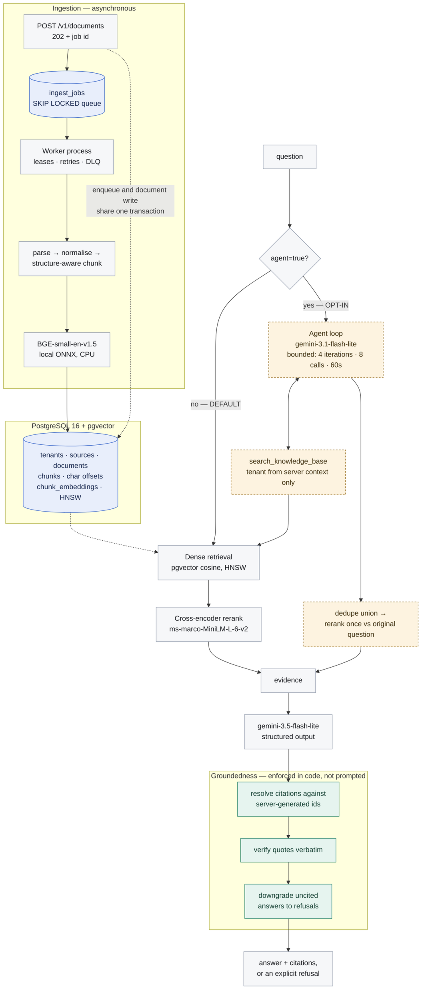

# Atlas

[](https://github.com/aniket0742/Atlas/actions/workflows/ci.yml)

A retrieval platform that answers questions about an organisation's own
documents, with citations, and refuses when the answer is not in the corpus.

**Status: Phase 4 complete.** Retrieval, asynchronous ingestion, and a bounded
agent/tool framework are implemented and evaluated.

The evaluation is the point. Four significant pieces of work — lexical
retrieval, hybrid fusion, hybrid-plus-reranking, and agent mode — are
implemented, tested, and **not enabled by default**, because the measurements
did not support adopting them. The runs behind every one of those decisions are
committed under [`eval/baselines/`](eval/baselines), including the runs for the
rejected configurations.

The default path is **dense retrieval + cross-encoder reranking + a grounded,
citation-validated answer**. Reasoning in [`Decision.md`](Decision.md), numbers
in [`docs/evaluation.md`](docs/evaluation.md).

---

## The problem

An organisation's knowledge is spread across policy documents, engineering docs,
wikis and repositories. People ask questions whose answers exist somewhere in
that material, and finding them is a search problem that keyword search handles
badly and that a general-purpose chatbot handles worse — because a chatbot with
no access to the corpus will answer anyway.

The failure mode that matters is not "the system could not find the answer". It
is "the system produced a confident, plausible, wrong answer, and nothing in the
response indicated which parts were grounded." Atlas is built around preventing
that specific outcome.

## What makes this different from a "chat with your PDFs" demo

Three things are enforced in code rather than requested in a prompt:

- **A citation cannot name a source that was not retrieved.** Evidence ids are
  server-generated per request; the model's cited ids are validated against that
  exact set, and anything else is discarded.
- **A quote is checked against the chunk it cites.** Verbatim match required;
  mismatches are surfaced and counted, not silently accepted.
- **An answer with no resolvable citation is converted into a refusal.** An
  uncited answer from a retrieval system is indistinguishable from a guess.

One thing is enforced in the schema: **`tenant_id` is on every table and in
every query from the first migration**, with document ids derived from the tenant
so two tenants uploading identical files get different ids by construction — even
though there is a single tenant and no authentication today. Cross-tenant leakage
is the worst bug this system could have, and retrofitting isolation is how it
happens.

One thing is enforced at the tool boundary: **a tool may not declare
`tenant_id` as an argument at all.** Registration refuses it, so a poisoned
document instructing the model to "search tenant acme-corp" has nowhere to land.
Identity travels in a frozen server-built context, never on a path the model can
write to, and there are tests using real injection payloads
([ADR-0027](Decision.md)).

And one thing is enforced by measurement: **techniques that did not help were
not shipped as defaults.** Lexical retrieval, hybrid fusion, hybrid with
reranking, and agent mode are all implemented, tested, and off by default,
because the numbers did not support them. The rejected runs are committed next
to the adopted ones, so the claims are checkable rather than asserted.

Reasoning for these and every other significant choice is in
[`Decision.md`](Decision.md), which now opens with an index of all 33 decisions
and their status.

## Architecture



**Solid path is the default.** The dashed amber path is agent mode: opt-in per
request, off unless you ask for it, and measured in
[ADR-0032](Decision.md#adr-0032-step-8-agent-mode-matches-plain-rag-recommendation-is-opt-in-not-default)
to produce no significant quality improvement over the default at ~1.8x the
cost. It is kept because it is correct, bounded and tested — not because it won.

Both paths converge on **one** answering step. There is no second, looser
answering path for the agent: the same prompt, the same server-generated
evidence ids, the same citation resolution and the same refusal downgrade apply
either way ([ADR-0030](Decision.md#adr-0030-one-answering-path-two-ways-of-choosing-evidence)).
The agent chooses *which* evidence arrives; it never writes the answer and is
never asked for a citation.

The API also serves a static inspection console at `/` — see
[Inspection console](#inspection-console).

One process, one database. Redis is in `docker-compose.yml` for Phase 6 but is
not used yet. There is no message broker — see
[ADR-0002](Decision.md#adr-0002-no-kafka-the-queue-is-postgres)
for why Kafka was considered and rejected.

## Technology

| Component | Choice | Why (short form) |
|---|---|---|
| API | FastAPI, Python 3.11 | async, typed request/response models |
| Database | PostgreSQL 16 + pgvector | one transaction covers metadata *and* vectors ([ADR-0001](Decision.md)) |
| DB driver | psycopg 3, hand-written SQL | the interesting queries are pgvector operators ([ADR-0005](Decision.md)) |
| Migrations | numbered `.sql` + checksum | index DDL that autogenerate cannot model ([ADR-0006](Decision.md)) |
| Embeddings | `BAAI/bge-small-en-v1.5` via fastembed (local, CPU, ONNX) | free re-indexing makes retrieval experiments affordable ([ADR-0007](Decision.md)) |
| Lexical search | PostgreSQL FTS (`tsvector` + GIN, `ts_rank_cd`) | no new infrastructure; **not BM25**, and not called that ([ADR-0017](Decision.md)) |
| Reranking | `Xenova/ms-marco-MiniLM-L-6-v2` cross-encoder, local | the one change measured to beat the baseline ([ADR-0020](Decision.md)) |
| Generation | `gemini-3.5-flash-lite` behind a `Protocol` | selected because nothing measurably beat it ([ADR-0024](Decision.md)) |
| Agent (opt-in) | `gemini-3.1-flash-lite` + in-house tool registry | bounded loop; no LangChain ([ADR-0026](Decision.md), [ADR-0029](Decision.md)) |
| UI | plain HTML/CSS/JS served by FastAPI | same-origin, no build step, no npm ([ADR-0015](Decision.md)) |
| Queue | Postgres `SELECT ... FOR UPDATE SKIP LOCKED` | enqueue shares a transaction with the write; no broker ([ADR-0002](Decision.md), [ADR-0022](Decision.md)) |
| Local env | Docker Compose (api + worker + postgres + redis) | one command starts everything ([ADR-0016](Decision.md)) |
| Tests | pytest | 276 unit tests run with no database and no API key; 41 more need only Postgres |
| CI | GitHub Actions | lint + both suites on every push, no secrets required ([ADR-0033](Decision.md)) |

## Running it locally

### Prerequisites

- Python 3.11+
- Docker Desktop (for Postgres with pgvector)
- A Gemini API key from <https://aistudio.google.com/apikey> — free tier is
  sufficient. Not needed for the test suite.

### Setup

```bash
cp .env.example .env            # then put your GEMINI_API_KEY in it
docker compose up -d --build    # api + postgres + redis; migrations run on start
```

Then open **<http://localhost:8000>**.

That is the whole setup. The API is containerised ([ADR-0016](Decision.md)), so
no host Python environment is needed to run Atlas. The first query downloads
~67MB of ONNX embedding weights into the `atlas_models` volume, where they
survive image rebuilds.

For the CLI, the test suite, or the eval harness, you also want a local
environment:

```bash
python -m venv .venv
.venv/Scripts/activate          # Windows;  source .venv/bin/activate elsewhere
pip install -e ".[dev]"
```

### Confirm your model

Free-tier model availability changes and is not reliably documented per model, so
Atlas does not hard-code a claim about it:

```bash
atlas models                    # lists what your key can actually reach
```

Set `ATLAS_LLM_MODEL` in `.env` to one of those.

**After changing `.env`, recreate the containers — do not restart them:**

```bash
docker compose up -d --force-recreate api worker
```

`env_file` is read when a container is *created*, not when it starts. `docker
compose restart` reuses the existing container with its original environment, so
code changes appear (the source is bind-mounted) while configuration changes
silently do not. The symptom is confusing: the console keeps reporting the old
model and the old API key while `.env` clearly says otherwise.

### Index and ask

```bash
atlas ingest eval/corpus --source handbook
atlas stats

atlas query "How long do customers have to request a refund?"
atlas query "How many vacation days do employees get?"   # should refuse
```

Or run the API on the host instead of in a container:

```bash
atlas serve                     # http://127.0.0.1:8000
```

## Inspection console

`http://localhost:8000` serves a single-page console for driving and inspecting
the system. It is a technical instrument rather than a chat product: everything
it shows is something the API already returns.

| Panel | Shows |
|---|---|
| Ask | question, with per-request overrides for retrieval mode, `top_k`, `min_similarity` and reranking |
| Agent mode | a toggle that runs the same question through the opt-in agent path, showing the searches it chose, the stop reason, and whether it fell back |
| Answer | the answer, or the refusal and its `refusal_reason` |
| Citations | quote, document, character span, page, and a **verbatim / not verbatim** badge |
| Retrieved chunks | every chunk sent to the model, in rank order, with **per-component scores**: dense similarity and rank, lexical rank, fused RRF score, reranker score |
| Request | retrieval mode, whether reranking ran, the gate's best dense score, per-stage latency and token usage |
| Corpus | document and chunk counts, per-document indexing status |
| Add a document | upload a file; returns a job id immediately and polls it to completion |
| Ingestion queue | pending / running / succeeded / dead counts, oldest pending age, and per-job errors with a requeue button |

Switching the retrieval mode and re-asking the same question is the quickest way
to see hybrid fusion working: the per-component chips show a chunk's dense rank,
its lexical rank, and the fused score that put it where it is.

The **verbatim badge** is the panel worth looking at: it makes the otherwise
invisible groundedness guarantee visible. A citation is only listed at all if its
id matched a chunk actually sent to the model, and the badge says whether the
quote was found character-for-character in that chunk.

Turning **agent mode** on disables the single-search controls, because the API
rejects them rather than silently ignoring them: they describe one search, and
the agent runs several with parameters it chooses. Reporting a `top_k` that
never applied would misdescribe what ran.

Responses are **not streamed** — the request blocks until the model returns, and
the console says so rather than animating text that has already arrived
([ADR-0015](Decision.md)). Uploads are asynchronous: the upload returns a job id
immediately and the console polls that job, because claiming success on the 202
would report a document as searchable before any worker had touched it.

## API

| Method | Path | Purpose |
|---|---|---|
| `GET` | `/health` | liveness, database reachability, active models |
| `GET` | `/v1/stats` | document / chunk / embedding counts for the tenant |
| `POST` | `/v1/documents` | queue a document for indexing (multipart) — returns **202** |
| `GET` | `/v1/documents` | list indexed documents |
| `GET` | `/v1/documents/{id}` | document detail, including failure reason |
| `GET` | `/v1/sources` | configured sources and their document counts |
| `POST` | `/v1/query` | ask a question; returns answer, citations, usage, timings |
| `GET` | `/v1/jobs` | queue depth and recent ingestion jobs |
| `GET` | `/v1/jobs/{id}` | one job's status, attempts and error |
| `POST` | `/v1/jobs/{id}/requeue` | return a dead-letter job to the queue |

`POST /v1/query` returns per-stage timings and token usage on every response, so
the numbers Phase 6 (observability) and Phase 8 (evaluation) need are available
from the start rather than requiring an API change later.

```bash
curl -s localhost:8000/v1/query -H 'content-type: application/json' \
  -d '{"question":"What happens after a chargeback?","include_evidence":true}'
```

**Agent mode is opt-in per request**, `"agent": true`, and off by default so the
plain path is unchanged for existing callers. The response then carries an
`agent_trace` describing the searches the model chose, the stop reason, the
evidence union before and after reranking, and whether it degraded to a plain
search:

```bash
curl -s localhost:8000/v1/query -H 'content-type: application/json' \
  -d '{"question":"What is the refund window, and who approves exceptions?","agent":true}'
```

Combining `agent` with the single-search knobs (`top_k`, `mode`, `rerank`,
`min_similarity`, `source_ids`) is a **400**, not a silent ignore. They describe
one search; the agent runs several with parameters it chooses, so honouring them
on some searches and not others would report a configuration that never ran.

**`POST /v1/documents` returns 202, not 201.** The document is queued, not
indexed — it is *not* searchable when the response arrives. Poll
`GET /v1/jobs/{job_id}`. This is a deliberate unversioned break; the reasoning is
in [ADR-0023](Decision.md). One consequence: document-type validation moved into
the worker, so a file this endpoint accepts can still fail, surfacing as a
dead-lettered job rather than a 415.

Error codes are meaningful: `413` too large, `422` empty upload, `502` the model
provider failed, `504` the model provider timed out. Atlas being healthy while
its upstream is not is a distinct condition.

## Ingestion

```bash
docker compose up -d          # starts a worker alongside the API
atlas jobs                    # queue depth and recent jobs
atlas worker --once           # drain the queue in the foreground, then exit
```

Uploads enqueue a job **in the same transaction that creates the source**, which
is the property a message broker cannot provide without an outbox table — and an
outbox table is a Postgres queue with an extra hop ([ADR-0002](Decision.md)).

Reliability behaviour, all covered by tests:

- **Concurrent workers never claim the same job** (`SKIP LOCKED`).
- **A crashed worker loses no work.** Jobs carry a lease; a reaper returns
  expired ones to the queue. Attempts are counted at *claim* time, so a document
  that reliably kills workers exhausts its budget instead of cycling forever.
- **Retries back off exponentially with jitter**, then land in a dead-letter
  state that **keeps its payload** so it can be requeued once the cause is fixed.
- **Unparseable documents are not retried** — the same bytes fail identically, so
  retrying only burns the budget and delays the real error.
- **Duplicate delivery is safe.** Deterministic ids plus the content-hash
  short-circuit make reprocessing converge rather than duplicate.

## Evaluation

Retrieval quality is measured, not asserted. The methodology, the label format
and its rationale are in [`docs/evaluation.md`](docs/evaluation.md).

```bash
atlas eval eval/datasets/smoke.jsonl               # retrieval only; free, no LLM
atlas eval eval/datasets/smoke.jsonl --with-answers  # adds refusal + citation metrics
```

Reports are JSON, written to `eval/results/`, and each one records the full
configuration that produced it — embedding model, chunk parameters, `k`,
similarity floor. A retrieval number without those is not comparable to anything.

Metrics reported: Recall@k, Precision@k, MRR, nDCG@k, each with a 95% bootstrap
confidence interval, plus (with `--with-answers`) refusal correctness in both
directions, citation coverage, unverified-quote count, latency percentiles and
token totals.

The shipped dataset has 19 queries (16 answerable, 3 unanswerable). That is a
smoke set for catching regressions, not a benchmark, and the confidence intervals
are wide enough to say so. Overlapping intervals mean no measured difference.

**Measured** on 112 queries over 33 documents (149 chunks), retrieval only:

| configuration | Recall@1 | nDCG@8 | retrieval p50 | adopted |
|---|---|---|---|---|
| dense (baseline) | 0.780 | 0.895 | 77 ms | — |
| lexical | 0.620 | 0.805 | 2 ms | no — significantly worse |
| hybrid (RRF) | 0.720 | 0.881 | 70 ms | no — no measured difference |
| **dense + rerank** | **0.850** | **0.939** | 750 ms | **yes** |
| hybrid + rerank | 0.850 | 0.935 | 758 ms | no — hybrid adds nothing here |

**Answer quality**, measured on the same 112 queries with retrieval held
constant (`eval/baselines/answer-models/`): every candidate model refused 12/12
unanswerable questions, wrongly refused 0 of 100 answerable ones, and produced a
resolvable citation on 100/100 answers. Models differ only in verbatim-quoting
fidelity, and `gemini-3.8-flash` is **not measurably better** than the selected
`gemini-3.5-flash-lite` at 4x the cost ([ADR-0024](Decision.md)).

**Tool routing**, 16 hand-built cases whose correct behaviour is known in
advance, including cases where the correct action is *not* to search
([`eval/baselines/agent-routing/`](eval/baselines/agent-routing)):

| model | tool-selection accuracy | unnecessary searches | mean latency | $/1k questions |
|---|---|---|---|---|
| **gemini-3.1-flash-lite** | 16/16 | 0 | **2,568 ms** | **$0.36** |
| gemini-3.5-flash-lite | 16/16 | 0 | 2,724 ms | $0.58 |
| gemini-3.7-flash | 16/16 | 0 | 4,684 ms | $1.83 |

Routing accuracy saturated at 16/16 for every candidate, so the choice was made
on latency and cost. An earlier 8-case benchmark saturated at 8/8 for all six
candidates tested; a benchmark that cannot separate candidates cannot justify
choosing one, which is why it was rebuilt around the failure modes routing
actually has ([ADR-0025](Decision.md)).

**Agent mode vs plain RAG**, the same 112 questions through both systems, paired
([`eval/baselines/step8-agent-vs-plain/`](eval/baselines/step8-agent-vs-plain)).
Quality is scored by whether a question's gold labels are satisfied by a chunk
the answer actually **cited** — stricter than "did it produce a citation":

| | plain RAG (default) | agent mode (opt-in) |
|---|---|---|
| citation recall, 100 answerable | 0.975 [0.94, 1.0] | 0.970 [0.93, 1.0] |
| paired delta (agent − plain) | — | **−0.005**, CI [−0.04, 0.03] |
| unanswerable correctly refused | 12/12 | 12/12 |
| answerable wrongly refused | 0 | 0 |
| unverified quotes | 6 | 6 |
| errors / degraded runs | 0 | 0 / 0 |
| cost per 1000 questions | $0.79 | $1.40 (**1.8x**) |
| latency p50 / p95 | 3,286 / 4,286 ms | 5,132 / 7,050 ms (**+56% / +64%**) |

**96 of 100 answerable questions scored identically.** Of the four that
differed, two favoured the agent and two favoured plain RAG. The paired delta's
confidence interval crosses zero, and so does every per-kind breakdown.

So agent mode ships **opt-in and off by default**. It is bounded, robust (0
errors and 0 degraded runs across 100 live executions) and its authorization
boundary is tested against prompt-injection payloads — but no measured quality
gain justifies 1.8x cost and ~60% more latency on this corpus
([ADR-0032](Decision.md#adr-0032-step-8-agent-mode-matches-plain-rag-recommendation-is-opt-in-not-default)).
The one place it shows promise is genuine multi-document questions, from a
sample of five, which is not enough to act on.

Comparisons use a **paired** bootstrap over per-query differences, not overlap of
independent intervals. The rule registered before the experiments used the
latter, which is the wrong test for paired data; the correction and the reasons
it is not post-hoc rationalisation are in [ADR-0021](Decision.md).

Four significant pieces of work — lexical retrieval, hybrid fusion, hybrid with
reranking, and agent mode — were implemented, measured, and **not adopted as
the default**. That is the intended outcome of measuring rather than assuming,
and the runs behind each rejection are committed in
[`eval/baselines/`](eval/baselines).

## Testing

```bash
pytest -m "not integration"     # 276 tests, no database or API key needed
# Integration tests need a database no live worker is polling: jobs.claim() is
# global by design, so a running worker competes with the tests for their jobs.
docker compose up -d && docker compose stop worker && pytest -m integration
```

All 317 tests run on every push ([`.github/workflows/ci.yml`](.github/workflows/ci.yml))
against a real `pgvector` Postgres, with **no API key**: every test uses the
deterministic offline providers, so a fork runs the whole suite with access to
nothing. The evaluation harness is deliberately not in CI — it calls real models
and costs real money; its results are frozen under `eval/baselines/` instead.

The integration job fails if its tests *skip*. They skip when no database is
reachable, which is right locally and would otherwise mean a broken service
container produced a green build that tested nothing.

The integration tests cover the properties that are hard to reason about without
a database: idempotent re-ingestion, version replacement without orphaned chunks,
concurrent ingestion of the same document, tenant isolation, and refusal on an
empty corpus.

## Known limitations

Current, and honest:

- **Chunking is unvalidated.** Structure-aware chunking is implemented and its
  invariants are tested, but whether it beats fixed-size chunking on this corpus
  has not been measured. Marked `provisional`. ([ADR-0009](Decision.md))
- **No authentication.** Every request is attributed to one configured tenant.
  The tenant plumbing is complete; the identity layer is Phase 5.
- **Multi-document queries are unsolved.** Questions needing evidence from two
  documents score Recall@1 of 0.400 under *every* configuration tested. No
  retrieval strategy here helps; it is an open problem, not a tuning gap.
- **Reranking costs ~680ms per query.** Adopted because the quality gain is
  measured and significant, but it is the dominant retrieval cost. Disable with
  `ATLAS_RERANK_ENABLED=false`.
- **The similarity floor no longer separates.** At 33 documents, 10 of 12
  unanswerable queries score above it. It is an interim crash barrier at 0.55,
  not a validated threshold ([ADR-0019](Decision.md)).
- **Lexical search is English-only** (`to_tsvector('english', ...)`) and is
  PostgreSQL FTS rather than BM25 ([ADR-0017](Decision.md)).
- **Embedding throughput is a concern.** *Measured* at roughly 350 ms per
  ~250-token chunk on one laptop CPU with the quantised ONNX build. Fine
  interactively, slow for bulk ingestion. Phase 6 target.
- **No OCR.** Scanned PDFs fail ingestion with an explicit message rather than
  indexing as empty.
- **No streaming.** `/v1/query` returns one complete response, so the console
  shows a spinner for the duration of the model call rather than incremental
  text. Deferred deliberately ([ADR-0015](Decision.md)).
- **The container image is a development image.** Editable install, root user,
  bind-mounted source. Phase 7 produces a deployment image.
- **Prompt injection is contained, not solved.** Retrieved text cannot mint a
  citation, and it cannot change *whose* data a tool reads: a tool may not
  declare `tenant_id` at all, so the attack has nowhere to land, and this is
  tested against poisoned-document payloads
  ([ADR-0027](Decision.md)). What retrieved text *can* still do is influence
  what the agent searches for next — wasting a turn or degrading an answer. And
  a document that states something false will be faithfully reported as stating
  it. ([ADR-0010](Decision.md))
- **Agent mode is not proven useful.** Measured against plain RAG on 112
  questions it shows no significant quality difference at 1.8x cost and ~60%
  more latency. It ships opt-in for that reason
  ([ADR-0032](Decision.md#adr-0032-step-8-agent-mode-matches-plain-rag-recommendation-is-opt-in-not-default)).
  The one suggestive result — multi-document questions — rests on five
  instances.
- **`mypy --strict` does not pass.** It is configured and reports 75 errors,
  most of them `Any` returned from untyped third-party SDKs. CI runs it as
  informational output and does not gate on it: a gate that has never been
  green is not a gate, and loosening the config until it passed would be worse
  than leaving the backlog visible ([ADR-0033](Decision.md)).

## Deliberately out of scope

Not "not done yet" — decided against for this project, so that what *is* built
could be built properly and measured.

| Area | Status | Why |
|---|---|---|
| **Authentication / RBAC** | out of scope | Every request is attributed to one configured tenant. The tenant *plumbing* is complete and enforced in every query and at the tool boundary ([ADR-0003](Decision.md), [ADR-0027](Decision.md)); what is absent is the identity layer that would populate it. Building isolation first and identity later is the safe order — the reverse is how cross-tenant leaks happen. |
| **Observability stack** | out of scope | No OpenTelemetry, Prometheus or dashboards. Structured logs carry the fields that would feed them (tool name, outcome, duration, tenant, request id), and the evaluation harness measures what a dashboard would only display. |
| **Deployment / infrastructure** | out of scope | The container image is a development image: editable install, root user, bind-mounted source. No TLS, no autoscaling, no load testing. This is a system to be read and run locally, not operated. |
| **Caching** | out of scope | Redis is in `docker-compose.yml` and unused. Caching before there is a measured latency problem optimises a guess. |
| **`query_metadata` tool** | deferred | A second agent tool for Atlas's own operational data (queue depth, failed ingestions, last-indexed time). Deliberately not built: the first tool has not yet justified the agent's cost, and adding a second would add code without changing that conclusion. |
| **Full tool-trace panel** | deferred | The console shows the agent's searches and stop reason, not a per-tool-event timeline. The trace is returned in full by the API for anyone who wants it. |
| **Streaming responses** | deferred | `/v1/query` returns one complete response ([ADR-0015](Decision.md)). |

## Roadmap

| Phase | Scope | State |
|---|---|---|
| 1 | End-to-end RAG, citations, tenancy in schema, **eval harness** | complete, E1+E2 run |
| 2 | Lexical + hybrid + reranking, measured against the Phase 1 baseline | complete — reranking adopted, hybrid rejected |
| 3 | Postgres job queue, workers, retries, DLQ, failure injection | complete |
| 4 | Tool framework, bounded agent loop, agent-vs-plain evaluation | complete — agent implemented, evaluated, **kept opt-in** |
| 5 | AuthN/AuthZ, RBAC, rate limiting | not started — see [out of scope](#deliberately-out-of-scope) |
| 6 | OpenTelemetry, Prometheus, caching, embedding throughput | not started — see [out of scope](#deliberately-out-of-scope) |
| 7 | Deployment, load testing | not started — see [out of scope](#deliberately-out-of-scope) |
| 8 | Expanded eval, failure injection | partially absorbed into Phases 2 and 4 |

Three deliberate departures from the original plan, all argued in `Decision.md`:
the eval harness ships in Phase 1 rather than Phase 8 (otherwise Phase 2's
"hybrid retrieval improved recall" claim has no baseline to compare against),
tenancy lands in the schema in Phase 1 rather than Phase 5, and Phase 4's
`search_github` and `query_metadata` tools were dropped once the first tool's
evaluation showed the agent did not yet justify its cost.

## Project layout

```text
src/atlas/
  agent/        tool registry, search tool, bounded loop, agent answering
  api/          FastAPI app, request/response schemas
  api/static/   the inspection console (3 files, no build step)
  answer/       prompt construction, citation validation, refusal policy
  core/         domain models, deterministic id derivation
  db/           connection pool, migrations, job queue, all SQL
  eval/         dataset format, metrics, runner, agent comparison harness
  ingest/       parsers, normalisation, chunking, pipeline, worker
  providers/    embedding / LLM / rerank protocols, Gemini, fastembed, offline fakes
  cli.py        migrate / ingest / query / eval / models / serve
migrations/     numbered SQL
scripts/        retrieval, answer-model, routing and agent-vs-plain experiments
eval/corpus/    sample knowledge base
eval/datasets/  labelled evaluation queries
eval/baselines/ frozen evidence for every number quoted in this README
tests/          unit tests (no infra) + integration tests (marked)
.github/        CI: lint, unit tests, integration tests against pgvector
Dockerfile      API image (development)
```
