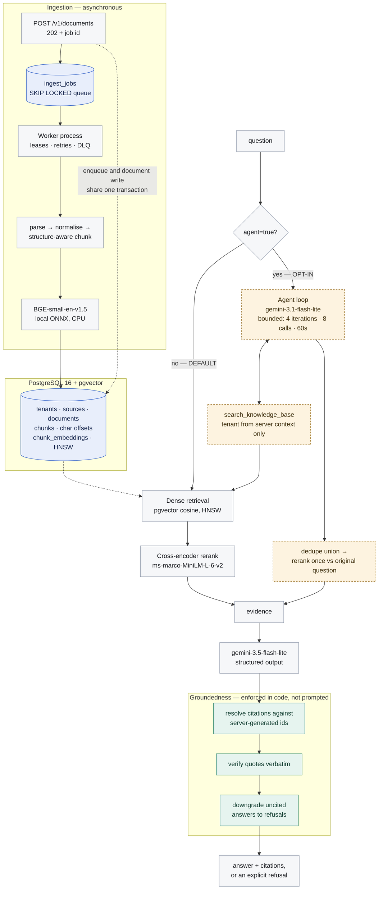

# Atlas

[](https://github.com/aniket0742/Atlas/actions/workflows/ci.yml)

A retrieval platform that answers questions about an organisation's own
documents, with citations, and refuses when the answer is not in the corpus.

**Status: complete.** Retrieval (dense, hybrid, reranking), asynchronous
ingestion, and a bounded agent/tool framework are implemented and evaluated.

The evaluation is the point. Four significant pieces of work — lexical
retrieval, hybrid fusion, hybrid-plus-reranking, and agent mode — are
implemented, tested, and **not enabled by default**, because the measurements
did not support adopting them. The runs behind every one of those decisions are
committed under [`eval/baselines/`](eval/baselines), including the runs for the
rejected configurations.

The default path is **dense retrieval + cross-encoder reranking + a grounded,
citation-validated answer**. Reasoning in [`Decision.md`](Decision.md), numbers
in [`docs/evaluation.md`](docs/evaluation.md).

---

## The problem

An organisation's knowledge is spread across policy documents, engineering
docs, wikis and repositories — a search problem keyword search handles badly
and a general-purpose chatbot handles worse, since a chatbot with no access to
the corpus answers anyway. The failure mode that matters is not "the system
could not find the answer" but "the system produced a confident, plausible,
wrong answer with nothing indicating which parts were grounded." Atlas is
built around preventing that specific outcome.

## What makes this different from a "chat with your PDFs" demo

Enforced in code, not requested in a prompt:

- **A citation cannot name a source that was not retrieved.** Evidence ids are
  server-generated per request and validated against that exact set.
- **A quote is checked verbatim against the chunk it cites.** Mismatches are
  surfaced and counted, not silently accepted.
- **An uncited answer is converted into a refusal**, not served as a guess.
- **`tenant_id` is on every table and every query from the first migration**,
  with ids derived from the tenant — even though there is a single tenant and no
  authentication today. Retrofitting isolation is how cross-tenant leaks happen.
- **A tool may not declare `tenant_id` as an argument at all.** A poisoned
  document instructing the model to "search tenant acme-corp" has nowhere to
  land — tested with real injection payloads ([ADR-0027](Decision.md)).
- **Techniques that did not help were not shipped as defaults.** Lexical
  retrieval, hybrid fusion, hybrid+reranking and agent mode are all
  implemented, tested, and off — the rejected runs are committed next to the
  adopted ones so the claims are checkable, not asserted.

Reasoning for every significant choice is in [`Decision.md`](Decision.md),
which opens with an index of all 33 decisions and their status.

## Architecture



**Solid is the default path.** Dashed amber is agent mode — opt-in, off by
default, measured to give no significant quality gain at ~1.8x the cost
([ADR-0032](Decision.md#adr-0032-step-8-agent-mode-matches-plain-rag-recommendation-is-opt-in-not-default)).
Both paths converge on **one** answering step — same prompt, same
server-generated ids, same citation resolution and refusal downgrade either way
([ADR-0030](Decision.md#adr-0030-one-answering-path-two-ways-of-choosing-evidence)).
The agent only ever chooses *which* evidence arrives.

One process, one database. The API also serves the inspection console at `/`
(below). Redis is in `docker-compose.yml`, unused; there is no message broker
([ADR-0002](Decision.md#adr-0002-no-kafka-the-queue-is-postgres)).

## Technology

| Component | Choice | Why (short form) |
|---|---|---|
| API | FastAPI, Python 3.11 | async, typed request/response models |
| Database | PostgreSQL 16 + pgvector | one transaction covers metadata *and* vectors ([ADR-0001](Decision.md)) |
| DB driver | psycopg 3, hand-written SQL | the interesting queries are pgvector operators ([ADR-0005](Decision.md)) |
| Migrations | numbered `.sql` + checksum | index DDL that autogenerate cannot model ([ADR-0006](Decision.md)) |
| Embeddings | `BAAI/bge-small-en-v1.5` via fastembed (local, CPU, ONNX) | free re-indexing makes retrieval experiments affordable ([ADR-0007](Decision.md)) |
| Lexical search | PostgreSQL FTS (`tsvector` + GIN, `ts_rank_cd`) | no new infrastructure; **not BM25**, and not called that ([ADR-0017](Decision.md)) |
| Reranking | `Xenova/ms-marco-MiniLM-L-6-v2` cross-encoder, local | the one change measured to beat the baseline ([ADR-0020](Decision.md)) |
| Generation | `gemini-3.5-flash-lite` behind a `Protocol` | selected because nothing measurably beat it ([ADR-0024](Decision.md)) |
| Agent (opt-in) | `gemini-3.1-flash-lite` + in-house tool registry | bounded loop; no LangChain ([ADR-0026](Decision.md), [ADR-0029](Decision.md)) |
| UI | plain HTML/CSS/JS served by FastAPI | same-origin, no build step, no npm ([ADR-0015](Decision.md)) |
| Queue | Postgres `SELECT ... FOR UPDATE SKIP LOCKED` | enqueue shares a transaction with the write; no broker ([ADR-0002](Decision.md), [ADR-0022](Decision.md)) |
| Local env | Docker Compose (api + worker + postgres + redis) | one command starts everything ([ADR-0016](Decision.md)) |
| Tests | pytest | 276 unit tests, no database or API key; 41 more need only Postgres |
| CI | GitHub Actions | lint + both suites on every push, no secrets required ([ADR-0033](Decision.md)) |

## Running it locally

**Prerequisites:** Python 3.11+, Docker Desktop, and a Gemini API key from
<https://aistudio.google.com/apikey> (free tier — not needed for the test
suite).

```bash
cp .env.example .env            # then put your GEMINI_API_KEY in it
docker compose up -d --build    # api + postgres + redis; migrations run on start
```

Open **<http://localhost:8000>**. That's the whole setup — no host Python
needed ([ADR-0016](Decision.md)). The first query downloads ~67MB of ONNX
weights into the `atlas_models` volume; they survive rebuilds.

For the CLI, tests, or the eval harness, add a local environment:

```bash
python -m venv .venv
.venv/Scripts/activate          # Windows; source .venv/bin/activate elsewhere
pip install -e ".[dev]"
```

**Confirm your model** — free-tier availability isn't reliably documented, so
ask the key rather than assume, then set `ATLAS_LLM_MODEL` in `.env` and
**recreate** rather than restart (`env_file` is read at container *creation*,
so a restart keeps the old config while code changes still take effect):

```bash
atlas models                                # lists what your key can actually reach
docker compose up -d --force-recreate api worker
```

**Index and ask:**

```bash
atlas ingest eval/corpus --source handbook
atlas stats

atlas query "How long do customers have to request a refund?"
atlas query "How many vacation days do employees get?"   # should refuse
```

Or run the API on the host instead of in a container: `atlas serve`
(<http://127.0.0.1:8000>).

## Inspection console

`http://localhost:8000` serves a single-page console for driving and inspecting
the system — a technical instrument, not a chat product: everything it shows is
something the API already returns.

| Panel | Shows |
|---|---|
| Ask | question, with per-request overrides for retrieval mode, `top_k`, `min_similarity` and reranking |
| Agent mode | a toggle that runs the same question through the opt-in agent path, showing the searches it chose, the stop reason, and whether it fell back |
| Answer | the answer, or the refusal and its `refusal_reason` |
| Citations | quote, document, character span, page, and a **verbatim / not verbatim** badge |
| Retrieved chunks | every chunk sent to the model, in rank order, with **per-component scores**: dense similarity and rank, lexical rank, fused RRF score, reranker score |
| Request | retrieval mode, whether reranking ran, the gate's best dense score, per-stage latency and token usage |
| Corpus | document and chunk counts, per-document indexing status |
| Add a document | upload a file; returns a job id immediately and polls it to completion |
| Ingestion queue | pending / running / succeeded / dead counts, oldest pending age, and per-job errors with a requeue button |

Re-asking the same question under a different retrieval mode is the quickest
way to see hybrid fusion working, via the per-component chips showing dense
rank, lexical rank, and the fused score. The **verbatim badge** makes the
otherwise invisible groundedness guarantee visible: a citation is only listed
if its id matched a chunk actually sent to the model, and the badge says
whether the quote was found character-for-character in it.

Agent mode disables the single-search controls (the API rejects them rather
than ignoring them). Responses are **not streamed**, so the console shows a
spinner rather than animating text that has already arrived
([ADR-0015](Decision.md)); uploads poll the job rather than trusting the 202,
since claiming success there would report a document searchable before any
worker touched it.

## API

| Method | Path | Purpose |
|---|---|---|
| `GET` | `/health` | liveness, database reachability, active models |
| `GET` | `/v1/stats` | document / chunk / embedding counts for the tenant |
| `POST` | `/v1/documents` | queue a document for indexing (multipart) — returns **202** |
| `GET` | `/v1/documents` | list indexed documents |
| `GET` | `/v1/documents/{id}` | document detail, including failure reason |
| `GET` | `/v1/sources` | configured sources and their document counts |
| `POST` | `/v1/query` | ask a question; returns answer, citations, usage, timings |
| `GET` | `/v1/jobs` | queue depth and recent ingestion jobs |
| `GET` | `/v1/jobs/{id}` | one job's status, attempts and error |
| `POST` | `/v1/jobs/{id}/requeue` | return a dead-letter job to the queue |

```bash
curl -s localhost:8000/v1/query -H 'content-type: application/json' \
  -d '{"question":"What happens after a chargeback?","include_evidence":true}'

# agent=true is opt-in and off by default; the response then carries an
# agent_trace (searches issued, stop reason, evidence union before/after rerank).
curl -s localhost:8000/v1/query -H 'content-type: application/json' \
  -d '{"question":"What is the refund window, and who approves exceptions?","agent":true}'
```

Combining `agent` with the single-search knobs (`top_k`, `mode`, `rerank`,
`min_similarity`, `source_ids`) is a **400**, not a silent ignore — they
describe one search, and the agent runs several with parameters it chooses.

**`POST /v1/documents` returns 202, not 201** — the document is queued, not
indexed, so poll `GET /v1/jobs/{job_id}`. A deliberate unversioned break
([ADR-0023](Decision.md)): document-type validation moved into the worker, so
a file this endpoint accepts can still fail as a dead-lettered job rather than
a 415. Error codes are otherwise meaningful: `413` too large, `422` empty
upload, `502`/`504` the model provider failed or timed out.

## Ingestion

```bash
docker compose up -d          # starts a worker alongside the API
atlas jobs                    # queue depth and recent jobs
atlas worker --once           # drain the queue in the foreground, then exit
```

Uploads enqueue a job **in the same transaction that creates the source**,
which is the property a message broker cannot provide without an outbox table
([ADR-0002](Decision.md)). Reliability behaviour, all covered by tests:

- **Concurrent workers never claim the same job** (`SKIP LOCKED`).
- **A crashed worker loses no work.** Jobs carry a lease; a reaper returns
  expired ones to the queue. Attempts are counted at *claim* time, so a
  document that reliably kills workers exhausts its budget instead of
  cycling forever.
- **Retries back off exponentially with jitter**, then land in a dead-letter
  state that **keeps its payload** so it can be requeued once the cause is
  fixed.
- **Unparseable documents are not retried** — the same bytes fail identically.
- **Duplicate delivery is safe** — deterministic ids plus a content-hash
  short-circuit make reprocessing converge rather than duplicate.

## Evaluation

Retrieval quality is measured, not asserted. Full methodology, per-kind
breakdowns and every frozen run are in
[`docs/evaluation.md`](docs/evaluation.md) and [`eval/baselines/`](eval/baselines);
this section is the headline numbers only.

```bash
atlas eval eval/datasets/smoke.jsonl                 # retrieval only; free, no LLM
atlas eval eval/datasets/smoke.jsonl --with-answers  # adds refusal + citation metrics
```

**Retrieval**, 112 queries over 33 documents (149 chunks):

| configuration | Recall@1 | nDCG@8 | p50 | adopted |
|---|---|---|---|---|
| dense (baseline) | 0.780 | 0.895 | 77 ms | — |
| lexical | 0.620 | 0.805 | 2 ms | no — worse |
| hybrid (RRF) | 0.720 | 0.881 | 70 ms | no — no difference |
| **dense + rerank** | **0.850** | **0.939** | 750 ms | **yes** |
| hybrid + rerank | 0.850 | 0.935 | 758 ms | no — adds nothing over rerank |

**Answer quality**, same 112 queries, retrieval held constant: every candidate
model refused 12/12 unanswerable and wrongly refused 0/100 answerable.
`gemini-3.5-flash-lite` was selected because `gemini-3.8-flash` is **not
measurably better** at 4x the cost ([ADR-0024](Decision.md)). Tool-routing
accuracy saturated at 16/16 for every candidate tested; `gemini-3.1-flash-lite`
won on latency and cost ([ADR-0025](Decision.md),
[`eval/baselines/agent-routing/`](eval/baselines/agent-routing)).

**Agent mode vs. plain RAG**, the same 112 questions through both systems,
paired, scored by whether the answer's *citations* (not just its retrieval)
satisfy the gold labels
([`eval/baselines/step8-agent-vs-plain/`](eval/baselines/step8-agent-vs-plain)):

| | plain RAG (default) | agent mode (opt-in) |
|---|---|---|
| citation recall, 100 answerable | 0.975 | 0.970 |
| paired delta (agent − plain) | — | **−0.005**, CI crosses zero |
| cost / latency vs. plain | — | **1.8x cost, +56–64% latency** |

96 of 100 questions scored identically; of the four that differed, two
favoured each system. **No measured quality gain justifies the cost**, so
agent mode ships opt-in and off by default
([ADR-0032](Decision.md#adr-0032-step-8-agent-mode-matches-plain-rag-recommendation-is-opt-in-not-default)).

All comparisons use a **paired** bootstrap over per-query differences, not
independent-interval overlap ([ADR-0021](Decision.md)). Four pieces of work
(lexical, hybrid, hybrid+rerank, agent mode) were implemented, measured, and
**not adopted as default**; every rejected run is committed, not deleted.

## Testing

```bash
pytest -m "not integration"     # 276 tests, no database or API key needed
# Integration tests need a database no live worker is polling: jobs.claim() is
# global by design, so a running worker competes with the tests for their jobs.
docker compose up -d && docker compose stop worker && pytest -m integration
```

All 317 tests run on every push ([`.github/workflows/ci.yml`](.github/workflows/ci.yml))
against a real `pgvector` Postgres, with **no API key** — every test uses the
deterministic offline providers, so a fork runs the whole suite with access to
nothing. The evaluation harness is deliberately not in CI: it calls real models
and costs real money, so its results are frozen under `eval/baselines/` instead.

The integration job fails if its tests *skip* rather than run — a broken
service container silently skipping every test would otherwise still report
green. Those tests cover what's hard to reason about without a database:
idempotent re-ingestion, version replacement without orphaned chunks,
concurrent ingestion, tenant isolation, and refusal on an empty corpus.

## Known limitations

Current, and honest:

- **Chunking is unvalidated.** Implemented and tested, but not measured against
  fixed-size chunking. Marked `provisional` ([ADR-0009](Decision.md)).
- **Multi-document queries are unsolved.** Recall@1 of 0.400 under *every*
  retrieval configuration tested — an open problem, not a tuning gap.
- **The similarity floor (0.55) no longer separates.** At 33 documents, 10 of 12
  unanswerable queries score above it; it's a crash barrier, not a validated
  threshold ([ADR-0019](Decision.md)).
- **Lexical search is English-only**, PostgreSQL FTS rather than BM25
  ([ADR-0017](Decision.md)).
- **Embedding throughput**: ~350ms per ~250-token chunk on one laptop CPU. Fine
  interactively, slow for bulk ingestion.
- **No OCR.** Scanned PDFs fail ingestion explicitly rather than indexing empty.
- **Prompt injection is contained, not solved.** A tool cannot be told whose
  data to read — tested with poisoned-document payloads
  ([ADR-0027](Decision.md)) — but retrieved text can still steer what the agent
  searches for, and a false document is faithfully reported as saying so
  ([ADR-0010](Decision.md)).
- **Agent mode is not proven useful.** No significant quality difference vs.
  plain RAG at 1.8x cost; ships opt-in for that reason
  ([ADR-0032](Decision.md#adr-0032-step-8-agent-mode-matches-plain-rag-recommendation-is-opt-in-not-default)).
- **`mypy --strict` reports 75 errors**, mostly `Any` from untyped SDKs. CI runs
  it as informational output, not a gate ([ADR-0033](Decision.md)).
- **No authentication, observability stack, deployment hardening or caching.**
  Tenant isolation is enforced in the schema and at the tool boundary
  ([ADR-0003](Decision.md), [ADR-0027](Decision.md)) with no identity layer on
  top of it; the container image is a development image; Redis is present and
  unused. This is a system meant to be read and run locally, not operated.

## Project layout

```text
src/atlas/
  agent/        tool registry, search tool, bounded loop, agent answering
  api/          FastAPI app, request/response schemas
  api/static/   the inspection console (3 files, no build step)
  answer/       prompt construction, citation validation, refusal policy
  core/         domain models, deterministic id derivation
  db/           connection pool, migrations, job queue, all SQL
  eval/         dataset format, metrics, runner, agent comparison harness
  ingest/       parsers, normalisation, chunking, pipeline, worker
  providers/    embedding / LLM / rerank protocols, Gemini, fastembed, offline fakes
  cli.py        migrate / ingest / query / eval / models / serve
migrations/     numbered SQL
scripts/        retrieval, answer-model, routing and agent-vs-plain experiments
eval/corpus/    sample knowledge base
eval/datasets/  labelled evaluation queries
eval/baselines/ frozen evidence for every number quoted in this README
tests/          unit tests (no infra) + integration tests (marked)
.github/        CI: lint, unit tests, integration tests against pgvector
Dockerfile      API image (development)
```
